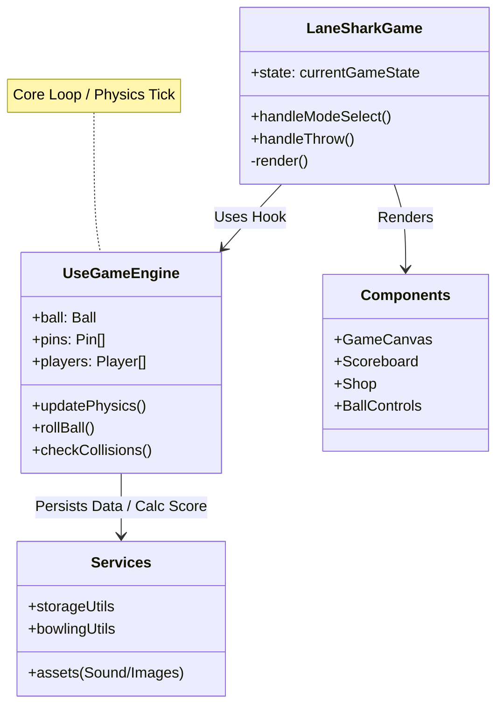

# System Architecture

## Overview

LaneShark uses a React-based component architecture driven by a custom hook-based game engine. The state is managed locally within `useGameEngine` and persisted via `localStorage`.

## Logic Flow (Mermaid)

## Key Components

- **LaneSharkGame.tsx**: The Root Controller. Handles high-level state (Menu vs Game), UI layouts, and connects the engine to the view.
- **useGameEngine.ts**: The "Brain". Contains the `requestAnimationFrame` loop, physics calculations, collision detection, and game rules.
- **GameCanvas.tsx**: The View. Purely presentation. Draws the state of the ball and pins onto an HTML5 Canvas.
- **storageUtils.ts**: Handles `localStorage` read/write for persistence.
